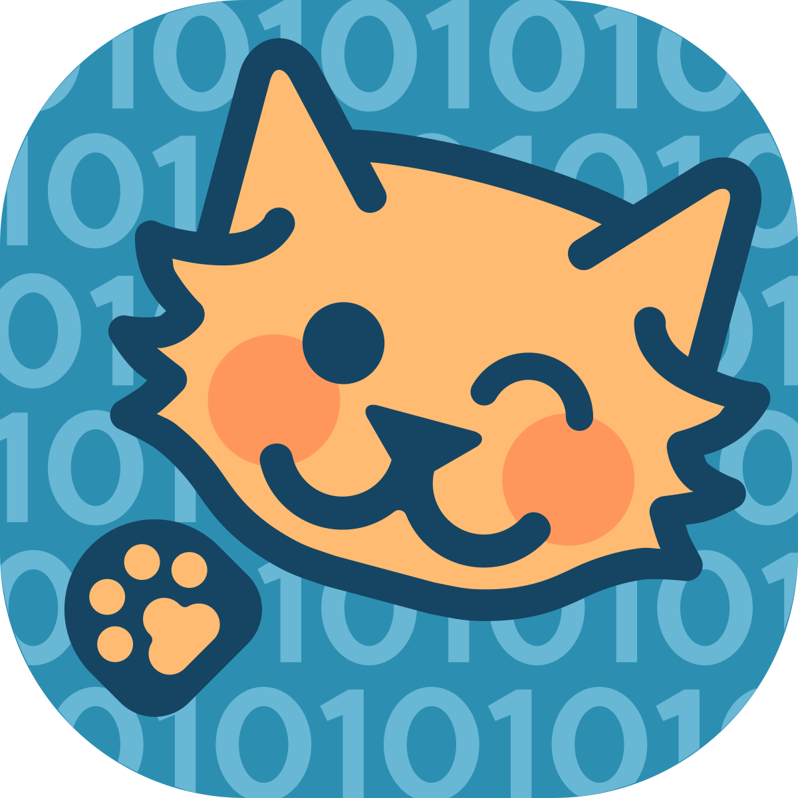

<!-- HEADER -->
<br />
<p align="center">
 <a href="https://github.com/Deathmajorasmask/Cryptocat">
    
 </a>

  <h3 align="center">Cryptocat</h3>

  <p align="center">
    An awesome cryptic chat created in php !
    <br />
  </p>
</p>

<!-- TABLE OF CONTENTS -->
<details open="open">
  <summary>Table of Contents</summary>
  <ol>
    <li>
      <a href="#about-the-project">About The Project</a>
      <ul>
        <li><a href="#built-with">Built With</a></li>
      </ul>
    </li>
    <li>
      <a href="#getting-started">Getting Started</a>
      <ul>
        <li><a href="#prerequisites">Prerequisites</a></li>
        <li><a href="#installation">Installation</a></li>
      </ul>
    </li>
    <li><a href="#screenshots">Screenshots</a></li>
    <li><a href="#roadmap">Roadmap</a></li>
    <li><a href="#contributing">Contributing</a></li>
    <li><a href="#license">License</a></li>
    <li><a href="#contact">Contact</a></li>
  </ol>
</details>


<!-- ABOUT THE PROJECT -->
## About The Project

[![Product Name Screen Shot][screenshot]](https://github.com/Deathmajorasmask/Cryptocat)

Its a chat inspired by the 'Cryptocat' browser extension, developed in php. Its operation is based on password rooms to ensure that only permitted users are chatting.

The messaging system constantly consults an encrypted database in mysql, it also works as a core for the development of new systems for publishing photos, memes, transferring private messages and other things.

The possibilities with this base are endless, so I hope you can take the source code of this project as an example.

### Built With

This project uses some external libraries, I list them below:
* [Sweetalert2](https://sweetalert2.github.io/)
* [DataTables Bootstrap3](https://datatables.net/examples/styling/bootstrap)
* [JQuery v3.1](https://ajax.googleapis.com/ajax/libs/jquery/3.1.0/jquery.min.js)
* [Bootstrap](https://getbootstrap.com/)


<!-- GETTING STARTED -->
## Getting Started

Follow the instructions below to get it working and proceed to modify or test this project.

### Prerequisites

You will have to download.
* XAMPP, WAMPP, MAMP or other server compatible with php 7.2.10


### Installation

1. Clone the repo
   ```sh
   git clone https://github.com/Deathmajorasmask/Cryptocat.git
   ```
3. Move Cryptocat files to hdocs.

4. Press 'Start' in XAMPP to MySQL & Apache.

5. Import 'chat_system.sql' to mysql (phpMyAdmin).

6. Open Cryptocat in Chrome, Firefox or Opera.
   ```sh
   http://localhost/
   ```


## Screenshots
![Product Name Screen Shot][screenshot01]
![Product Name Screen Shot][screenshot02]
![Product Name Screen Shot][screenshot03]


<!-- ROADMAP -->
## Roadmap

See the [open issues](https://github.com/Deathmajorasmask/Cryptocat/issues) for a list of proposed features (and known issues).


<!-- CONTRIBUTING -->
## Contributing

Contributions are what make the open source community such an amazing place to learn, inspire, and create. Any contributions you make are **greatly appreciated**.

1. Fork the Project
2. Create your Feature Branch (`git checkout -b feature/AmazingFeature`)
3. Commit your Changes (`git commit -m 'Add some AmazingFeature'`)
4. Push to the Branch (`git push origin feature/AmazingFeature`)
5. Open a Pull Request


<!-- LICENSE -->
## License

Distributed under the MIT License. See `LICENSE` for more information.


<!-- CONTACT -->
## Contact

Deathmajorasmask - zijaham_link@hotmail.com

Project Link: [https://github.com/Deathmajorasmask/Cryptocat](https://github.com/Deathmajorasmask/Cryptocat)


<!-- MARKDOWN LINKS & IMAGES -->
[screenshot]: images/Screen01_Cryptocat.JPG
[screenshot01]: images/Screen02_Cryptocat.JPG
[screenshot02]: images/Screen03_Cryptocat.JPG
[screenshot03]: images/Screen04_Cryptocat.JPG
